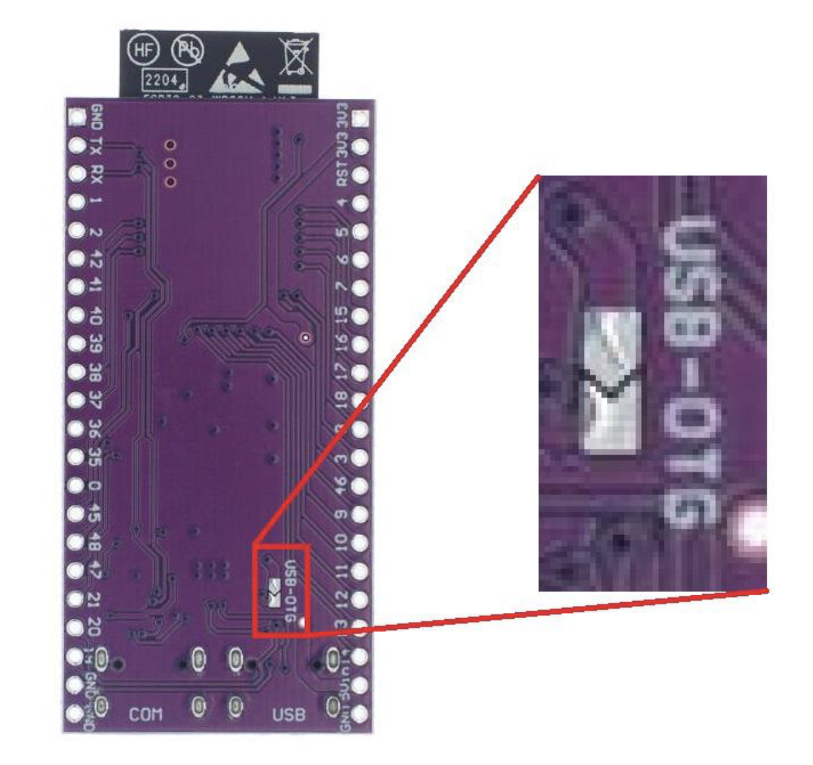

# TONEX ONE Controller


## Table of Contents
- [Overview](#overview)
- [Disclaimer](#disclaimer)
- [Features](#features)
- [Hardware Requirements](#hardware-requirements)
- [Installation](#installation)
- [Configuration](#configuration)
- [Build and flash](#build-and-flash)
- [Usage](#usage)
- [Troubleshooting](#troubleshooting)
- [Contributing](#contributing)
- [License](#license)

## Overview

The TONEX ONE Controller is a project that enables MIDI support for the TONEX ONE device. It allows users to change active presets on the TONEX ONE using a USB connection, significantly enhancing its versatility in live performance and studio settings.

## Disclaimer

This project is an unofficial "addon" for the TONEX ONE device and is not affiliated with, endorsed by, or supported by IK Multimedia. 

Use of this project is at your own risk. The author and contributors of this project are not responsible for any damage or issues that may arise from using this project.

## Features

- Translates MIDI Program Change messages to TONEX ONE commands
- Based on the ESP32-S3 microcontroller
- Built using ESP-IDF (Espressif IoT Development Framework)
- Enables integration of TONEX ONE into complex pedalboards with MIDI controllers

> Description of communication protocol can be found [here](/protocol.md)

## Hardware Requirements

To implement this project, you'll need:

1. ESP32-S3 board
2. MIDI input circuit connected to PIN 5 of ESP32-S3

### MIDI Input Circuit

The MIDI input circuit can be constructed using the design available at:
[Notes and Volts - MIDI and Arduino: Build a MIDI Input Circuit](https://www.notesandvolts.com/2015/02/midi-and-arduino-build-midi-input.html)

#### Connection Details

| Target | Pin |
|--------|-----|
| Receive Data (RxD) | 5 |
| 5V | 3.3V |
| Ground | GND |

**Note:** Basic soldering skills are required for assembling the MIDI input circuit.

### USB Host Support on some ESP32-S3 clone boards

Some ESP32-S3 boards do not function as USB hosts out of the box, which can lead to errors like this:

```
I (1378) TONEX_CONTROLLER_USB: Opening CDC ACM device 0x1963:0x00D1...
I (2378) TONEX_CONTROLLER_USB: Failed to open device
```

To enable USB host functionality, you may need to solder a jumper on the back of the board. The soldering area will typically resemble this:



To complete the setup, connect the two small pads shown in the image with solder. This modification bridges the connection required for USB host support.

## Installation

1. Clone this repository:
   ```
   git clone https://github.com/vit3k/tonex_controller.git
   ```
2. Navigate to the project directory:
   ```
   cd tonex_controller
   ```
3. Set up ESP-IDF environment (if not already done)

## Configuration

1. Set the target to ESP32-S3:
   ```
   idf.py set-target esp32s3
   ```

2. Because default FIFO size configuration options for ESP32S3 are not suitable for Tonex One as it has wPacketMaxSize set to 512 for OUT endpoint modification of internals of IDF is needed:

   - Open file: `components/hal/usb_dwc_hal.c`
   - Locate the `usb_dwc_hal_set_fifo_bias` function
   - Modify as follows:
     ```c
     case USB_HAL_FIFO_BIAS_DEFAULT:
         fifo_config.nptx_fifo_lines = OTG_DFIFO_DEPTH / 4;
     ```

> If anyone knows a better solution for this issue please let me know.

## Build and Flash
Build the project and flash it to the board:
```
idf.py -p PORT flash monitor
```
(Exit serial monitor with `Ctrl-]`)

## Usage
The controller supports MIDI Program Change messages to control the active slot on your TONEX ONE device:

1. **MIDI Channel**: Hardcoded in `midi.cpp` file (`MIDI_CHANNEL` constant)
2. **Program Change Mapping**:
   - Program 1: Changes active slot to A
   - Program 2: Changes active slot to B

To use:
1. Ensure your MIDI controller is connected to the MIDI input circuit
2. Send Program Change messages from your MIDI controller
3. The controller will translate these to commands for TONEX ONE

## Troubleshooting

### Flashing Error on Mac

If you encounter a flashing error on Mac:

1. Install the driver from: [CH34XSER_MAC_ZIP](https://www.wch-ic.com/downloads/CH34XSER_MAC_ZIP.html)
2. Use the device `/dev/cu.wchusbserial*` for flashing

## Contributing

Contributions are welcome! Please feel free to submit a Pull Request.

## License

This project is licensed under the [MIT License](LICENSE). See the [LICENSE](LICENSE) file for details.
